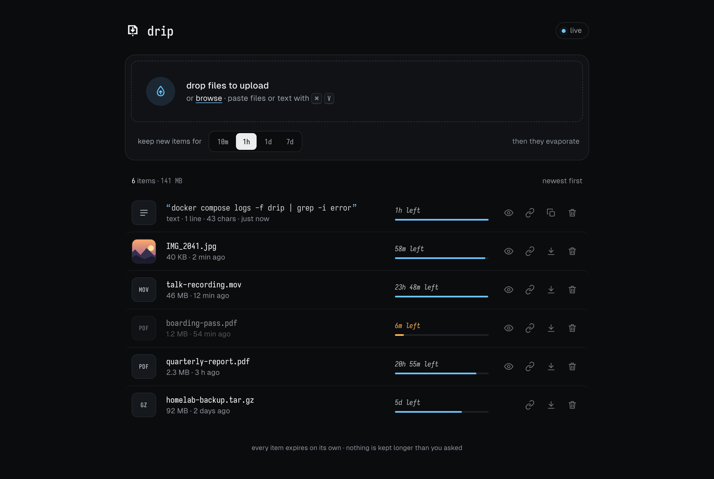

# drip

A stupid simple file upload server with real-time updates and auto-expiration.

- Drop, paste or pick files (several at once) with upload progress
- Choose how long each upload lives; the list counts down to expiry
- Copy a download link, or preview images, video, audio, PDFs and text in the browser
- Share files straight from your phone when installed as a PWA
- Every open tab updates live

## Running

### Docker Compose

```yaml
services:
  drip:
    image: ghcr.io/bfpimentel/drip:latest
    container_name: drip
    restart: always
    ports:
      - "7123:7123"
    volumes:
      - ./uploads:/app/uploads
      - ./data:/app/data
```

Files are removed automatically once they expire. Uploads and their metadata survive restarts as long as both volumes are mounted.

The container runs as UID 1000, so the mounted directories must be writable by it (`chown -R 1000:1000 uploads data`). With rootless Podman, add `:U` to the volume options instead (e.g. `./uploads:/app/uploads:U`).

### Configuration

| Variable              | Default         | Description                                 |
| --------------------- | --------------- | ------------------------------------------- |
| `FILE_LIFESPAN_HOURS` | `1`             | Default lifespan (fractions allowed)        |
| `MAX_UPLOAD_MB`       | `0` (unlimited) | Maximum size of a single upload request     |
| `PORT`                | `7123`          | Port to listen on                           |
| `UPLOAD_DIR`          | `./uploads`     | Where uploaded files are stored             |
| `DATA_DIR`            | `./data`        | Where file metadata (`metadata.json`) lives |

Paths are relative to `app.py`, which is `/app` inside the container. Besides the default, uploads can be set to expire in 10m, 1h, 1d or 7d.

### Local development

Requires [uv](https://docs.astral.sh/uv/):

```sh
uv sync
uv run app.py
```

Then open http://localhost:7123. Run the checks with:

```sh
uv run pytest
uv run ruff check
uv run ruff format --check
```

### PWA Installation

The app can be installed as a PWA. Use a reverse proxy (nginx, traefik, caddy) with HTTPS to enable the install prompt. Once installed, drip shows up in the system share sheet (on platforms that support Web Share Target, e.g. Android), and shared files are uploaded with the default lifespan.

## Screenshots


